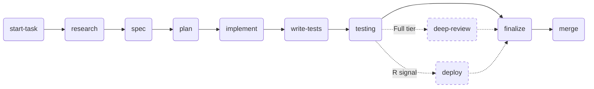

# Solo Kanban

[](LICENSE)
[](CHANGELOG.md)
[](#status)

Solo Kanban is a git-native delivery framework for solo developers working with AI coding agents.

It keeps product intent, technical scope, implementation steps, validation, and closure evidence in versioned files rather than in chat history or a private task tracker.

## Why This Exists

Classic Kanban is useful for visualizing work, but it is usually under-specified for a single developer who delegates implementation to AI agents. Solo Kanban adds the missing contract:

- a tiny planning system that lives in the repository;
- one active task workspace per slice;
- explicit discovery, design, execution, and closure gates;
- WIP limits that prevent context drift;
- archived task evidence for future agents and humans.

The result is a lightweight process that gives AI agents enough structure to execute safely without turning solo work into heavyweight project management.

## Core Ideas

- **Git-visible state:** planning files, task artifacts, and decisions are committed with the code.
- **WIP max 2:** one primary task plus one urgent fix at most.
- **Vertical slices:** any task larger than two days is split into mergeable increments.
- **Research before certainty:** risky or ambiguous work gets a bounded research artifact before implementation.
- **Specification before code:** non-trivial code changes get a short technical spec.
- **Quality gates:** every transition has a validation expectation.
- **Archive on close:** completed workspaces move to `tasks/archive/<slug>/`.

## Pipeline



The actual pipeline for a task is selected by its **tier**, derived from a Risk Profile of five signals: contract change (`C`), security (`S`), migration (`M`), cross-domain (`X`), runtime impact (`R`). See [`docs/workflow.md`](docs/workflow.md) `Step Matrix` for the full rules.

| Tier | Trigger | Pipeline |
|---|---|---|
| **Lightweight** | No signals | `implement → testing → finalize` |
| **Standard** | 1-2 of `{C, X, R}` only | full pipeline above, `deep-review` skipped |
| **Full** | any `S` / `M`, 3+ signals, or large diff | full pipeline above with `deep-review` mandatory |

`finalize` combines documentation updates and task closure so docs, follow-ups, archive movement, and merge preparation happen in one explicit phase.

A complete worked example — every artifact filled in for one real task — lives in [`examples/sample-task/`](examples/sample-task/).

## Repository Layout

```text
solo-kanban/
  docs/                  Method, workflow, artifact contract, agent guidance
  templates/planning/    NEXT, DONE, BUGS, TECH-DEBT, BACKLOG, DECISIONS, ROADMAP
  templates/task/        requirements, research, spec, implementation checklist
  agents/claude/commands Claude command files for the workflow verbs
  agents/codex/skills    Codex skills for core/planning/delivery/finalize
  examples/minimal/      Minimal project layout
```

## Quick Start

1. Copy `templates/planning/*.md` into your project planning directory, for example `docs/planning/`.
2. Copy `templates/task/*.md` into `tasks/templates/`.
3. Add the workflow summary from `docs/workflow.md` to your repository agent instructions.
4. Optional: copy `agents/claude/commands/*.md` into your Claude commands directory.
5. Optional: copy `agents/codex/skills/*` into your Codex skills directory.
6. For every task, classify the Risk Profile and create `tasks/<slug>/` from the task templates. Trivial sub-lightweight changes (comments, formatting, obvious typos) may skip the workspace and live as a one-line `DONE.md` entry plus the commit.
7. Keep `NEXT.md` and `DONE.md` as the source of truth for work state.

A minimal project layout looks like this:

```text
your-repo/
  docs/planning/NEXT.md
  docs/planning/DONE.md
  docs/planning/BUGS.md
  docs/planning/TECH-DEBT.md
  docs/planning/BACKLOG.md
  docs/planning/DECISIONS.md
  tasks/templates/*.md
  tasks/<active-task>/*.md
  tasks/archive/<closed-task>/*.md
```

## Documentation

- `docs/method.md` explains the operating model.
- `docs/workflow.md` defines the pipeline and gates.
- `docs/artifact-contract.md` defines the file formats.
- `docs/ai-agent-playbook.md` explains how AI agents should use the framework.
- `agents/claude/commands/*.md` contains Claude command adapters.
- `agents/codex/skills/*/SKILL.md` contains Codex skill adapters.

## Status

Version 1.0.0 — first public release. The framework intentionally avoids project-specific deployment, infrastructure, database, or application rules. Add local rules in your own repository on top of this baseline.

## Contributing

See [CONTRIBUTING.md](CONTRIBUTING.md) for how to propose changes, report friction, or add adapters for other agents. By participating you agree to the [Code of Conduct](CODE_OF_CONDUCT.md).

## Changelog

See [CHANGELOG.md](CHANGELOG.md) for release notes.

## License

[MIT](LICENSE) © 2026 Vitaliy Semenov.
